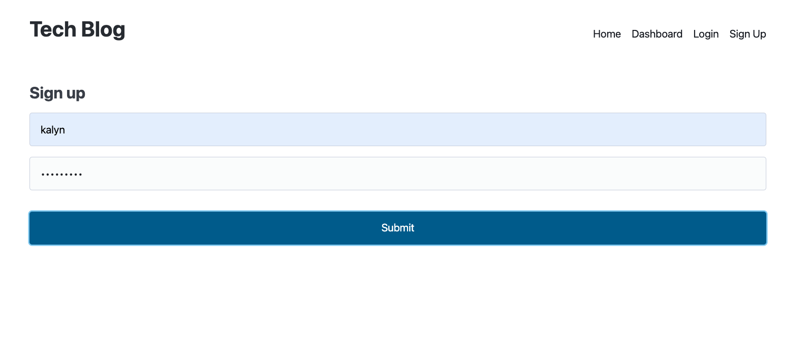

# Tech Blog

## Links
- [GitHub Repo](https://github.com/kalynsifuentez/tech-blog.git)
- [Deployed Application](https://nameless-crag-55395-1bec364c2ecf.herokuapp.com/)

## Description

A CMS-style blog site similar to a Wordpress site, where developers can publish their blog posts and comment on other developers’ posts as well. You’ll build this site completely from scratch and deploy it to Heroku. Your app will follow the MVC paradigm in its architectural structure, using Handlebars.js as the templating language, Sequelize as the ORM, and the express-session npm package for authentication.

## User Story

```md
AS A developer who writes about tech
I WANT a CMS-style blog site
SO THAT I can publish articles, blog posts, and my thoughts and opinions
```

## About

Site renders to homepage, with an option to sign-up, login, logout and to create posts and comments.

## Screenshot

 

## Technology

Application’s folder structure follows:
- Model-View-Controller paradigm
- [express-handlebars](https://www.npmjs.com/package/express-handlebars) package to implement Handlebars.js and Views
- [MySQL2](https://www.npmjs.com/package/mysql2)
- [Sequelize](https://www.npmjs.com/package/sequelize)
- Express.js API for Controllers
- [dotenv package](https://www.npmjs.com/package/dotenv) to use environment variables
- [bcrypt package](https://www.npmjs.com/package/bcrypt) to hash passwords
- [express-session](https://www.npmjs.com/package/express-session)
- [connect-session-sequelize](https://www.npmjs.com/package/connect-session-sequelize)

## Credits

- Tutor: Jose Lopez
- Student Collaboration: Martin Harvey
- Online: Thomas Calle